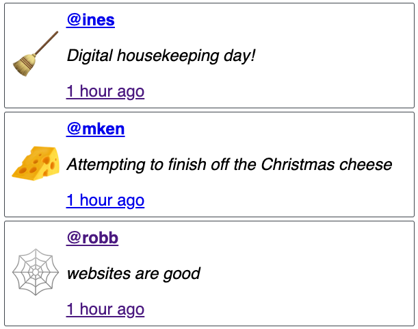

# status.lol web component

A basic web component to mess around with how they work. Used [the-claw-webring-widget](https://github.com/whitep4nth3r/the-claw-webring-widget) for reference.

Loads statuses from [status.lol](https://status.lol) either for a specific user or all statuses.

## Build

`npm run build` will output to `dist`

## Usage

```html
<status-lol address="robb" limit="2"></status-lol>
<script src='./dist/status-lol.mjs' type="module"></script>
```

Optional attributes:

- `address` if this is empty, it will load all statuses
- `limit` if this is empty, it will load just the first status



